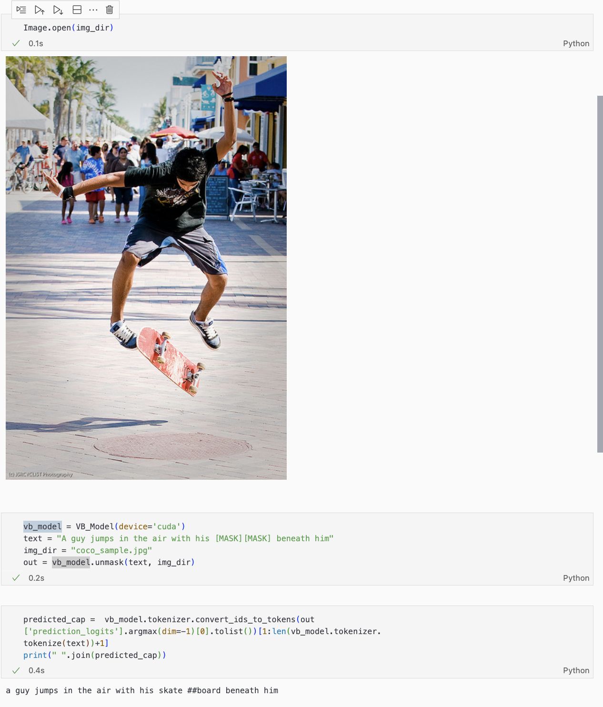

# VisualBert-Inference
> The codebase is largely brought from [huggingface/transformers](https://github.com/huggingface/transformers/tree/main/examples/research_projects/visual_bert), with my own modifications/wrapping to make it work smoother.

See the [inference.ipynb](https://github.com/Jiayi-Pan/VisualBert-Inference/blob/main/inference.ipynb) for a demo.